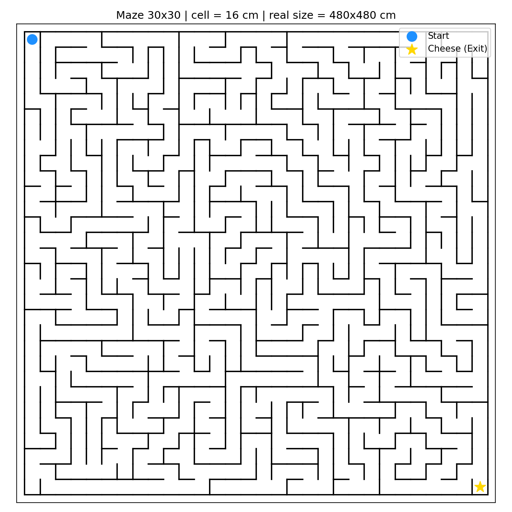

# Maze Mouse

จำลองหนูหาชีสในเขาวงกต ระบบสร้างเขาวงกตแบบสุ่ม (perfect maze), หนูที่เดินตัดสินใจทีละ 1 ก้าวโดยใช้ "กลิ่นชีส" (flood-fill distance field), และแสดงผลแบบกราฟิก real-time ด้วย pygame



## สารบัญ

- [วิธีติดตั้งและรัน](#วิธีติดตั้งและรัน)
- [การตั้งค่า](#การตั้งค่า)
- [โครงสร้างไฟล์](#โครงสร้างไฟล์)
- [ระบบการทำงานทั้งหมด](#ระบบการทำงานทั้งหมด)
- [หน้าจอเกม](#หน้าจอเกม)

## วิธีติดตั้งและรัน

```bash
pip install pygame matplotlib
python main.py
```

จะเปิดหน้าต่าง pygame ขึ้นมา สร้างเขาวงกตใหม่ทุกครั้งที่รัน แล้วหนูจะเดินหาชีสให้ดูแบบ real-time โดยอัตโนมัติ (ไม่ต้องกดควบคุมอะไร)

## การตั้งค่า

แก้ไขได้ที่ [main.py](main.py):

```python
game = GameEngine(
    size=30,           # ขนาดเขาวงกต (จำนวนช่องต่อด้าน)
    cell_size_cm=16,    # ขนาดจริงของแต่ละช่อง (ซม.) ใช้คำนวณสเกลจริงเท่านั้น
    seed=None,          # ใส่เลข เช่น seed=42 ถ้าอยากได้เขาวงกตเดิมซ้ำทุกครั้ง
    solver="displacement",  # เลือกสมองหนู: "displacement" หรือ "scent" (ดูคำอธิบายด้านล่าง)
)
```

โหมดสมองหนู (solver) มี 2 แบบ:
- `"displacement"` (ค่าเริ่มต้น) — อัลกอริทึม **LRTA\*** (Learning Real-Time A\*, Korf 1990): หนูรับรู้แค่**การกระจัดเส้นตรง**ไปหาชีส (ตรงกับเส้นประสีแดงบนจอ) เป็นความเชื่อตั้งต้น แล้ว**เรียนรู้**แก้ความเชื่อระหว่างเดิน — ทางตันที่ "กลิ่นเหมือนใกล้" จะถูกปรับค่าให้แพงขึ้นทุกครั้งที่หลงเข้าไป จนหมดแรงดึงดูดไปเอง ไม่มีการคำนวณล่วงหน้าใดๆ ถึงชีสได้เสมอแต่ไม่การันตีเส้นทางสั้นสุด
- `"scent"` — กลิ่นชีสแผ่ตามทางเดิน (flood fill คำนวณครั้งเดียวตอนเริ่ม) หนูเดินตาม gradient — การันตี shortest path

## โครงสร้างไฟล์

```
Mouse_Maze/
├── main.py              # จุดเริ่มโปรแกรม
├── game_engine.py        # เกมลูปหลัก ผูกทุกโมดูลเข้าด้วยกัน + จับเวลา + เช็คตาย/ชนะ
├── maze_model.py          # Cell, Maze — โครงสร้างข้อมูลหลักของเขาวงกต
├── maze_generator.py       # สร้างเขาวงกตด้วย Recursive Backtracking + ตรวจสอบ shortest path
├── agent.py                # Mouse — ตำแหน่ง, ทิศทาง, การเคลื่อนไหวทีละ 1 การกระทำ
├── solver.py                # FloodFillSolver — คำนวณ "กลิ่นชีส" ตัดสินใจทีละก้าว
├── renderer_pygame.py        # แสดงผลกราฟิก real-time (กำแพง, หนู, ชีส, เส้นประ, HUD)
├── generate_maze.py            # สคริปต์แยก: generate + export เขาวงกตเป็นภาพ/ข้อความ
├── maze_visualizer.py           # ตัวช่วยของ generate_maze.py (matplotlib + text)
├── test_sim.py                   # ทดสอบแบบไม่เปิดจอ: รัน solver ทั้งสองกับ maze 10 ชุด
└── maze.png                      # ตัวอย่างภาพเขาวงกตที่ export ไว้
```

| ไฟล์ | หน้าที่ |
|---|---|
| [main.py](main.py) | จุดเริ่มโปรแกรม ตั้งค่าขนาด/seed แล้วสั่งรันเกม |
| [game_engine.py](game_engine.py) | ลูปหลักของเกม: สร้างเขาวงกต → สร้างหนู → สร้าง solver → เรียก renderer ทุกเฟรม → เช็คเงื่อนไขตาย/ชนะ |
| [maze_model.py](maze_model.py) | นิยาม `Cell` (กำแพง 4 ด้าน) และ `Maze` (กระดาน + จุดเริ่ม/จุดจบ) |
| [maze_generator.py](maze_generator.py) | เจาะทางเดินด้วย DFS สุ่ม (Recursive Backtracking) แล้วใช้ BFS ตรวจสอบว่า shortest path ≥ 5 ก้าว |
| [agent.py](agent.py) | คลาส `Mouse` เก็บตำแหน่ง/ทิศทาง และรับ action ทีละ 1 อย่าง (`FORWARD`/`BACKWARD`/`TURN_LEFT`/`TURN_RIGHT`) |
| [solver.py](solver.py) | สมองหนู 2 แบบ: `FloodFillSolver` (กลิ่นแบบสนามระยะทาง — shortest path) และ `LRTASolver` (LRTA\* จากการกระจัดเส้นตรง — ไม่มี precomputation) ทั้งคู่รับข้อมูลผ่าน observation dict เท่านั้น ไม่เคยเห็นผังเขาวงกต |
| [renderer_pygame.py](renderer_pygame.py) | วาดเขาวงกต, หนู, ชีส, เส้นประระยะกระจัด, และ HUD แสดงสถานะ |
| [generate_maze.py](generate_maze.py) | สคริปต์เดี่ยวๆ ไว้สร้างเขาวงกตแล้ว export เป็นภาพ (`maze.png`) กับ text — ไม่เกี่ยวกับตัวเกม |
| [maze_visualizer.py](maze_visualizer.py) | ตัวช่วยวาดของ `generate_maze.py` (ASCII text + matplotlib PNG ตามสเกลจริง) |

## ระบบการทำงานทั้งหมด

### 1. สร้างเขาวงกต (`maze_generator.py`)
ใช้อัลกอริทึม **Recursive Backtracking** (DFS แบบสุ่มทิศ) เจาะทางเดินจนครบทุกช่อง ผลลัพธ์คือ **perfect maze** — ทุกช่องเชื่อมถึงกันด้วยเส้นทางเดียวเท่านั้น การันตีว่าจุดเริ่มกับชีสเชื่อมถึงกันเสมอ

หลังสร้างเสร็จจะรัน BFS หาความยาว shortest path จากจุดเริ่มไปชีส ถ้าสั้นกว่า 5 ก้าว จะ**สร้างใหม่ทั้งหมด**จนกว่าจะผ่านเงื่อนไข

### 2. หนูรับรู้ "กลิ่นชีส" (`solver.py`)
`FloodFillSolver` รัน BFS **ครั้งเดียว** ตอนเริ่มเกม แผ่ค่าระยะทางจากช่องชีสไปทุกช่องในเขาวงกต (เก็บเป็น `distance_field`) — นี่คือสิ่งที่จำลอง "หนูได้กลิ่นชีสทั่วเขาวงกต" แต่**ไม่ใช่เส้นทางสำเร็จรูป** หนูไม่รู้ล่วงหน้าว่าต้องเดินไปทางไหนทั้งหมด

### 3. หนูตัดสินใจทีละก้าว (`agent.py` + `solver.py`)
ทุก step หนูจะ:
1. ดูช่องข้างเคียงที่เดินได้จริง (ไม่มีกำแพงกั้น)
2. เทียบค่า `distance_field` เลือกทิศที่ใกล้ชีสที่สุด
3. ถ้าทิศนั้นไม่ตรงกับทิศที่หันหน้าอยู่ (`heading`) จะต้อง **เลี้ยวก่อน** — เลี้ยวได้ครั้งละ 1 ครั้งต่อ 1 การเคลื่อนไหวเท่านั้น (`TURN_LEFT`/`TURN_RIGHT`)
4. ถ้าทิศตรงกับ heading อยู่แล้ว จะเดิน (`FORWARD`/`BACKWARD`) ไป 1 ช่อง

พฤติกรรมนี้จำลองหุ่นยนต์จริงที่เลี้ยวทีละครั้ง ไม่ใช่ teleport ไปตามเส้นทางที่รู้ล่วงหน้า

### 4. เกมลูปหลักและเงื่อนไขจบเกม (`game_engine.py`)
แต่ละ step ของลูป:
1. จับเวลาที่ solver ใช้ "คิด" (`decide_next_action` + `apply_action`) สะสมไว้เป็น **computation time** — ถ้าสะสมเกิน **180 วินาที** หนูจะ "ตาย" (แพ้เพราะคิดนานเกินไป)
2. Render ภาพใหม่ทุกเฟรมผ่าน `renderer_pygame.py`
3. หน่วงเวลาด้วย `tick(30)` ให้เกมวิ่งไม่เกิน 30 เฟรม/วินาที (เพื่อให้ตาเห็นหนูเดินทีละก้าวได้ทัน) — เวลาส่วนนี้ถูกนับรวมแยกต่างหากเป็น **total time (real time)** ซึ่งจะมากกว่า computation time มาก เพราะเป็นการหน่วงเพื่อแสดงผล ไม่ใช่เวลาคิดของอัลกอริทึม
4. เกมจบเมื่อหนูถึงชีส (ชนะ) หรือ computation time เกิน 180 วินาที (แพ้)

### 5. การแสดงผล (`renderer_pygame.py`)
วาดทุกเฟรม:
- กำแพงของทุกช่อง
- จุดเริ่ม (สีฟ้า) และชีส (วงกลมสีทอง)
- **เส้นประสีแดง** แสดงระยะกระจัดตรง (เส้นตรง ไม่สนใจกำแพง) จากตัวหนูไปยังชีส อัปเดตตำแหน่งทุกเฟรมตามที่หนูขยับ
- ตัวหนู (วงกลมสีน้ำตาล มีจุดสีขาวบอกทิศที่หันหน้าอยู่)
- HUD ด้านล่างแสดงจำนวนก้าว, total time (real), computation time (algo) เทียบกับ budget 180 วินาที, และทิศทางปัจจุบัน

## หน้าจอเกม

```
┌──────────────────────────────────────┐
│  [เขาวงกต + กำแพง + หนู + ชีส]         │
│  [เส้นประสีแดง ชี้จากหนูไปชีส]          │
│                                        │
│  Step: N   Total time (real): X.XXXs  │
│  Computation time (algo): X.XXms/180000ms │
│  Heading: N/S/E/W                     │
│  [Success! ... เมื่อหนูถึงชีสแล้ว]       │
└──────────────────────────────────────┘
```
